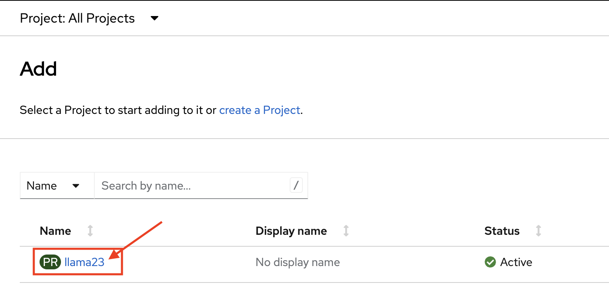
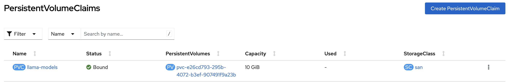

# Hands-on Lab: Deploy a Large Language Model on Power10

In this lab you'll use a pretrained Large Language Model and deploy it on OpenShift. It will make use of the unique Power10 features such as the Vector Scalar Extension (VSX) as well as the newly introduced Matrix Math Accelerator (MMA) units. 

The first part of the lab will focus on the following steps:
- Create a persistent volume to store the model
- Create a deployment using an existing container image that will load the model, serve it and make it accessible via the browser
- Create a service for internal communication
- Create a route for external communication

The second part of the lab will focus on these topics:
- Deploy a vector database, specifically milvus
- Index the database with a sample PDF
- Query the database using pymilvus
- Create a prompt based on the previous answer and pass to the LLM

## 0 Setup

We'll be using the IBM Montpellier RADAR environment which is an dedicated OpenShift cluster. 

You'll be provided with a workstation that has access to the RADAR environment by using OpenVPN.

Click on the OpenVPN icon and then `connect` by using the provided credentials.

[image]

Once you're connected you can find a quicklink icon on the desktop that opens the OpenShift webconsole where you have to login using htpasswd using the provided credentials.

[image]

Once you're logged in you'll find youryelf in the Developer perspective and see a prepared project corresponding to your username that has a Snapshot / PVC where the Large Language model artifact is already downloaded for your convenience.



Select that project to make it the default.

## Part 1: Deploy Large Language Model

Now we're going to create several resources using the WebUI.

### Option A: Using the OpenShift web console

### 1.1 Snapshot / PVC

In the "Administrator" view go to:

Storage -> PersistentVolumeClaims 

You should see an existing PVC:



**IF THIS IS NOT THE CASE YOU CAN CREATE THIS USING THE FOLLOWING STEP:**

-> Create PersistentVolumeClaim

Go to the YAML view (`Edit YAML` link) and replace the default with


```yaml
apiVersion: v1
kind: PersistentVolumeClaim
metadata:
  name: llama-models
spec:
  accessModes:
    - ReadWriteOnce
  storageClassName: san
  resources:
    requests:
      storage: 10Gi
```

Click Create!

### 1.2 Deployment

Next we'll go to Workloads -> Deployments -> Create Deployment

Select the `YAML view` radio button and replace the default with:

```yaml
apiVersion: apps/v1
kind: Deployment
metadata:
  name: llama-cpp-server
spec:
  replicas: 1
  selector:
    matchLabels:
      app: llama-cpp-server
  template:
    metadata:
      labels:
        app: llama-cpp-server
    spec:
      initContainers:
        - name: fetch-model-data
          image: ubi8
          volumeMounts:
            - name: llama-models
              mountPath: /models
          command:
            - sh
            - '-c'
            - |
              if [ ! -f /models/tinyllama-1.1b-chat-v1.0.Q8_0.gguf ] ; then
                curl -L https://huggingface.co/TheBloke/TinyLlama-1.1B-Chat-v1.0-GGUF/resolve/main/tinyllama-1.1b-chat-v1.0.Q8_0.gguf --output /models/tinyllama-1.1b-chat-v1.0.Q8_0.gguf
              else
                echo "model /models/tinyllama-1.1b-chat-v1.0.Q8_0.gguf already present"
              fi
          resources: {}
      nodeSelector:
        feature.node.kubernetes.io/cpu-cpuid.MMA: "true"
      containers:
        - name: llama-cpp
          image: quay.io/mgiessing/llama-cpp-server:latest
          args: ["-m", "/models/tinyllama-2.1b.gguf", "-c", "4096", "-b", "32"]
          ports:
            - containerPort: 8080
              name: http
          volumeMounts:
            - name: llama-models
              mountPath: /models
          readinessProbe:
            httpGet:
              path: /
              port: 8080
              scheme: HTTP
            initialDelaySeconds: 5
            timeoutSeconds: 1
            periodSeconds: 10
            successThreshold: 1
            failureThreshold: 3
          livenessProbe:
            httpGet:
              path: /
              port: 8080
              scheme: HTTP
            timeoutSeconds: 1
            periodSeconds: 10
            successThreshold: 1
            failureThreshold: 3
      volumes:
        - name: llama-models
          persistentVolumeClaim:
            claimName: llama-models
```

Click Create! 

This could take a few moments as it initially fetches the model artifact (if not present) and then probes if the container is ready & live.

### 1.3 Create a service

For the communication we will create a service as well as a route:

Networking -> Services -> Create Service

Replace the default with:

```yaml
apiVersion: v1
kind: Service
metadata:
  name: "llama-service"
  labels:
    app: "llama-service"
spec:
  type: "ClusterIP"
  ports:
    - name: llama-cpp-server
      port: 8080
      protocol: TCP
      targetPort: 8080
  selector:
    app: "llama-cpp-server"
```

Click Create!

### 1.4 Create the route

Finally we'll create a route to our deployment

Networking -> Routes -> Create Route:

`YAML view` radio button and replace the default with

```yaml
kind: Route
apiVersion: route.openshift.io/v1
metadata:
  name: llama-cpp
  labels:
    app: llama-service
spec:
  to:
    kind: Service
    name: llama-service
  tls: null
  port:
    targetPort: llama-cpp-server
```
  
Click Create!

If we now go to the developer view and watch the Topology we can see the llama-cpp server represented as a circle with a dark blue ring if everything deployed correctly:

[image]


### 1.5 Access your model

We can access the model by clicking on the little Arrow button in the upper right corner of the circle.

This should open a new browser where you can experiment with the deployed Large Language Model!

First don't change any of the parameters and just scroll down to to input field "Say something..." where you can interact with the LLM.

[image]

You can ask any question you like, but keep in mind we're using a small model and there are more powerful models out there.

### Option B: Using CLI

**IF YOU DEPLOYED THE MODEL SERVER USING OPTION A YOU CAN SKIP THIS PART AND DIRECTLY GO TO Part 2!**

There is also a short version to do all of this in just a few steps using the CLI:

You will need your OpenShift login token which you can get after logging in to the WebUI, click on your username -> Copy login command -> Login again with your credentials -> Display token


Open the terminal and login to your cluster using the token
`oc login --token=<YOUR TOKEN> --server=https://api.cadiz.edu.ihost.com:6443`

```bash
# Get the lab repository
git clone https://github.com/mgiessing/bcn-lab-2084 && cd bcn-lab-2084

cd Part1-Deploy-LLM

# Apply the resources
oc apply -f .

# Watch until pod is up and running
oc get pods -w

#Get the URL by:
oc get routes llama-service -o jsonpath='{.spec.host}'
```

Get the URL and open in the browser.

You can ask any question you like, but keep in mind we're using a small model (although contradicotry to the term "Large Language Model") and there are more powerful models out there.

## Part 2: Enhance with RAG using Milvus & LangChain

In the second part we will create a vector database (Milvus) that we'll be using for indexing data.

### 2.1 Deploy Milvus

You can stay in the same OpenShift project.

You will need your OpenShift login token which you can get after logging in to the WebUI, click on your username -> Copy login command -> Login again with your credentials -> Display token


Open the terminal and login to your cluster using the token
`oc login --token=<YOUR TOKEN> --server=https://api.cadiz.edu.ihost.com:6443`

If you haven't downloaded the git repository yet (which you've just done if you used the "short way" before) do it now:

```bash
# Get the lab repository
git clone https://github.com/mgiessing/bcn-lab-2084 && cd bcn-lab-2084
```

Now we're going to create the milvus deployment:

```
cd Part2-RAG/milvus-deployment

oc create configmap milvus-config --from-file=./config/milvus.yaml

oc apply -f .

cd ..
```

Verify that three new pods are running:

`oc get pods | grep deployment`

You should see etcd-deployment, milvus-deployment and minio-deployment

### 2.2 Deploy Notebookserver

To interact with Milvus and our Large Language Model we're using a Notebookserver

```bash
cd nb-deployment

oc apply -f .
```

Verify the notebook pod is running:

`oc get pods | grep notebook`

Once the container is deployed you should be able to access it using the link from: 

`oc get route cpu-notebook -o jsonpath='{.spec.host}'`

If you open the notebook server in your browser now drag & drop the notebook (`RAG.ipynb`) from this repo into the notebookserver.

Follow the steps inside the notebook!

## Conclusion

Congratulations, you've successfully finished the lab `Deploy a Large Language Model on Power10` and learned how to use that as a standalone solution as well as combining it with more complex technologies such as Retrieval Augmented Generation (RAG).
