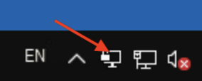
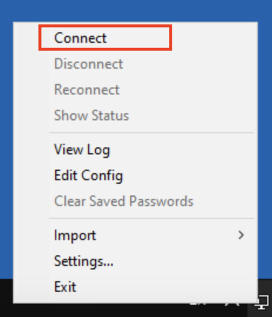
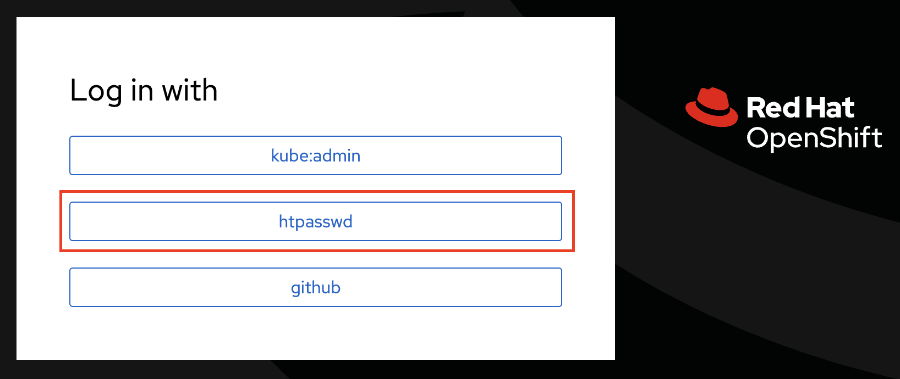
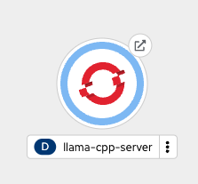
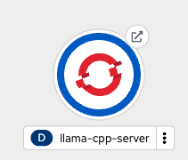

# Hands-on Lab: Deploy a Large Language Model on Power10

In this lab you'll use a pretrained Large Language Model and deploy it on OpenShift. It will make use of the unique Power10 features such as the Vector Scalar Extension (VSX) as well as the newly introduced Matrix Math Accelerator (MMA) units. 

The first part of the lab will focus on the following steps:
- Create a persistent volume to store the model
- Create a deployment using an existing container image that will load the model, serve it and make it accessible via the browser
- Create a service for internal communication
- Create a route for external communication

The second part of the lab will focus on these topics:
- Deploy a vector database, specifically milvus
- Index the database with a sample PDF
- Query the database using pymilvus
- Create a prompt based on the previous answer and pass to the LLM

## 0 Setup

>***Note:** <br>It might be helpful to open this lab guide inside the VM in a seperate firefox browser tab for copy & paste code blocks.*

You'll be using the IBM Montpellier RADAR environment which is an dedicated OpenShift cluster. 

You'll be provided with a workstation that has access to the RADAR environment by using OpenVPN.

Once you enter the VM right-click on the OpenVPN icon in the taskbar and then choose **connect** to enter the provided credentials.

  

Once you're connected you can find a quicklink icon **OCP Cadiz Console** on the desktop that opens the OpenShift webconsole where you have to login using **htpasswd** using the provided credentials.



Once you're logged in you'll find yourself in the **Developer** perspective and see a prepared project corresponding to your username that has a Snapshot / PVC where the Large Language model artifact is already downloaded for your convenience.


Click on that project to make it the default.

## Part 1: Deploy Large Language Model

Now you're going to create several resources using the WebUI.

### Option A: Using the OpenShift web console

### 1.1 Snapshot / PVC

In the **Administrator** view go to:

**Storage** -> **PersistentVolumeClaims** 

You should see an existing PVC:


**IF THIS IS NOT THE CASE YOU CAN CREATE THIS USING THE FOLLOWING STEP:**

-> **Create PersistentVolumeClaim**

Go to the YAML view (**Edit YAML** link) and replace the default with


```yaml
apiVersion: v1
kind: PersistentVolumeClaim
metadata:
  name: llama-models
spec:
  accessModes:
    - ReadWriteOnce
  storageClassName: san
  resources:
    requests:
      storage: 10Gi
```

Click Create!

### 1.2 Deployment

> ***Note**: If you have problems copy & paste the code using Ctrl+C / Ctrl+V inside the VM you might need to use the browser tools. <br><br>
Therefore, copy the code from the git, place your cursor in the empty YAML view box, hit the "Alt" key to reveal the hidden menu, use "Edit" -> "Paste"*

Next you'll go to **Workloads** -> **Deployments** -> **Create Deployment**

Select the **YAML view** radio button and replace the default with:

```yaml
apiVersion: apps/v1
kind: Deployment
metadata:
  name: llama-cpp-server
spec:
  replicas: 1
  selector:
    matchLabels:
      app: llama-cpp-server
  template:
    metadata:
      labels:
        app: llama-cpp-server
    spec:
      initContainers:
        - name: fetch-model-data
          image: ubi8
          volumeMounts:
            - name: llama-models
              mountPath: /models
          command:
            - sh
            - '-c'
            - |
              if [ ! -f /models/tinyllama-1.1b-chat-v1.0.Q8_0.gguf ] ; then
                curl -L https://huggingface.co/TheBloke/TinyLlama-1.1B-Chat-v1.0-GGUF/resolve/main/tinyllama-1.1b-chat-v1.0.Q8_0.gguf --output /models/tinyllama-1.1b-chat-v1.0.Q8_0.gguf
              else
                echo "model /models/tinyllama-1.1b-chat-v1.0.Q8_0.gguf already present"
              fi
          resources: {}
      nodeSelector:
        feature.node.kubernetes.io/cpu-cpuid.MMA: "true"
      containers:
        - name: llama-cpp
          image: quay.io/mgiessing/llama-cpp-server:latest
          args: ["-m", "/models/tinyllama-1.1b-chat-v1.0.Q8_0.gguf", "-c", "4096", "-b", "32"]
          ports:
            - containerPort: 8080
              name: http
          volumeMounts:
            - name: llama-models
              mountPath: /models
          readinessProbe:
            httpGet:
              path: /
              port: 8080
              scheme: HTTP
            initialDelaySeconds: 5
            timeoutSeconds: 1
            periodSeconds: 10
            successThreshold: 1
            failureThreshold: 3
          livenessProbe:
            httpGet:
              path: /
              port: 8080
              scheme: HTTP
            timeoutSeconds: 1
            periodSeconds: 10
            successThreshold: 1
            failureThreshold: 3
      volumes:
        - name: llama-models
          persistentVolumeClaim:
            claimName: llama-models
```

Click Create! 

This could take a few moments as it initially fetches the model artifact (if not present) and then probes if the container is ready & live.

### 1.3 Create a service

For the communication you will create a service as well as a route:

**Networking** -> **Services** -> **Create Service**

Replace the default with:

```yaml
apiVersion: v1
kind: Service
metadata:
  name: "llama-service"
  labels:
    app: "llama-service"
spec:
  type: "ClusterIP"
  ports:
    - name: llama-cpp-server
      port: 8080
      protocol: TCP
      targetPort: 8080
  selector:
    app: "llama-cpp-server"
```

Click Create!

### 1.4 Create the route

Finally you'll create a route to your deployment

**Networking** -> **Routes** -> **Create Route**

**YAML view** radio button and replace the default with

```yaml
kind: Route
apiVersion: route.openshift.io/v1
metadata:
  name: llama-cpp
  labels:
    app: llama-service
spec:
  to:
    kind: Service
    name: llama-service
  tls: null
  port:
    targetPort: llama-cpp-server
```
  
Click Create!

If you now go to the developer view and watch the Topology you can see the llama-cpp server represented as a circle with a dark blue ring if everything deployed correctly:

Light blue ring: (not yet ready)

 

Dark blue ring: (ready)




### 1.5 Access your model

You can access the model by clicking on the little Arrow button in the upper right corner of the circle.

This should open a new browser where you can experiment with the deployed Large Language Model!

First don't change any of the parameters and just **scroll down to to input field "Say something..."** where you can interact with the LLM.


You can ask any question you like, but keep in mind you're using a small model and there are more powerful models out there for general conversation.

Feel free to experiment with the model parameters like temperature and predictions.

In the second part you'll see that smaller, resource-efficient models like this can answer questions based on a given context and instructions quite well! That will demonstrate that huge models aren't always required!

### _Option B: Using CLI_


**_IF YOU DEPLOYED THE MODEL SERVER USING OPTION A YOU CAN SKIP THIS PART AND DIRECTLY GO TO Part 2!_**

_There is also a short version to do all of this in just a few steps using the CLI:_

_You will need your OpenShift login token which you can get after logging in to the WebUI, click on your username -> Copy login command -> Login again with your credentials -> Display token_


_Open the terminal and login to your cluster using the token
`oc login --token=<YOUR TOKEN> --server=https://api.cadiz.edu.ihost.com:6443`_

```bash
# Get the lab repository
git clone https://github.com/mgiessing/bcn-lab-2084 && cd bcn-lab-2084

cd Part1-Deploy-LLM

# Apply the resources
oc apply -f .

# Watch until pod is up and running
oc get pods -w

#Get the URL by:
oc get routes llama-service -o jsonpath='{.spec.host}'
```

_Get the URL and open in the browser._

## Part 2: Enhance with RAG using Milvus & LangChain

In the second part you will create a vector database (Milvus) that you'll be using for indexing a sample PDF file.

### 2.1 Deploy Milvus

You can stay in the same OpenShift project.

You will need your OpenShift login token which you can get after logging in to the WebUI, **click on your username** -> **Copy login command** -> **Login again with your credentials** -> **Display token**


Open the terminal (command prompt or PowerShell) and login to your cluster using:

`oc login --token=<YOUR TOKEN> --server=https://api.cadiz.edu.ihost.com:6443`

Clone the repository using Github Desktop or use the terminal:

```bash
# Get the lab repository
git clone https://github.com/mgiessing/bcn-lab-2084 && cd bcn-lab-2084
```

Now you're going to create the milvus deployment:

```
cd Part2-RAG/milvus-deployment

oc create configmap milvus-config --from-file=./config/milvus.yaml

oc apply -f .

cd ..
```

Monitor deployment using:

`oc get pods -w`

Wait until you see etcd-deployment, milvus-deployment and minio-deployment in the "running" state.

The `-w, --watch` command can be interrupted with Ctrl+C.

### 2.2 Deploy Notebookserver

To interact with Milvus and your Large Language Model you're using a Notebookserver:

```bash
cd nb-deployment

oc apply -f .
```

Verify the notebook pod is running:

`oc get pods --selector=app=cpu-notebook -w`

Once the container is deployed you should be able to access it using the link from: 

`oc get route cpu-notebook -o jsonpath='{.spec.host}'`

The URL should look like this:

http://cpu-notebook-llamaXX.apps.cadiz.edu.ihost.com (where XX is your user/number)

If you open the notebook server in your browser now drag & drop the notebook (`RAG.ipynb`) from this repo into the notebook server.

Follow the steps inside the notebook!

## Conclusion

Congratulations, you've successfully finished the lab `Deploy a Large Language Model on Power10` and learned how to use that as a standalone solution as well as combining it with more complex technologies such as Retrieval Augmented Generation (RAG).
